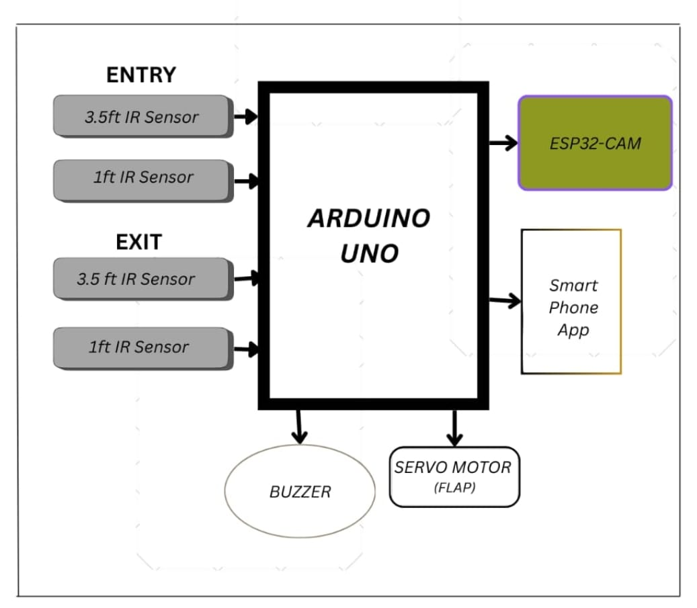
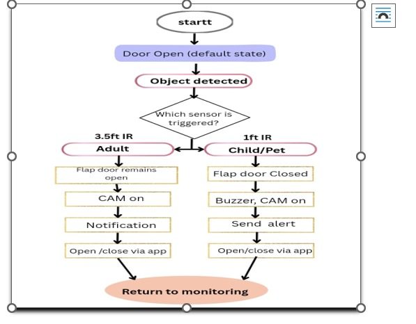
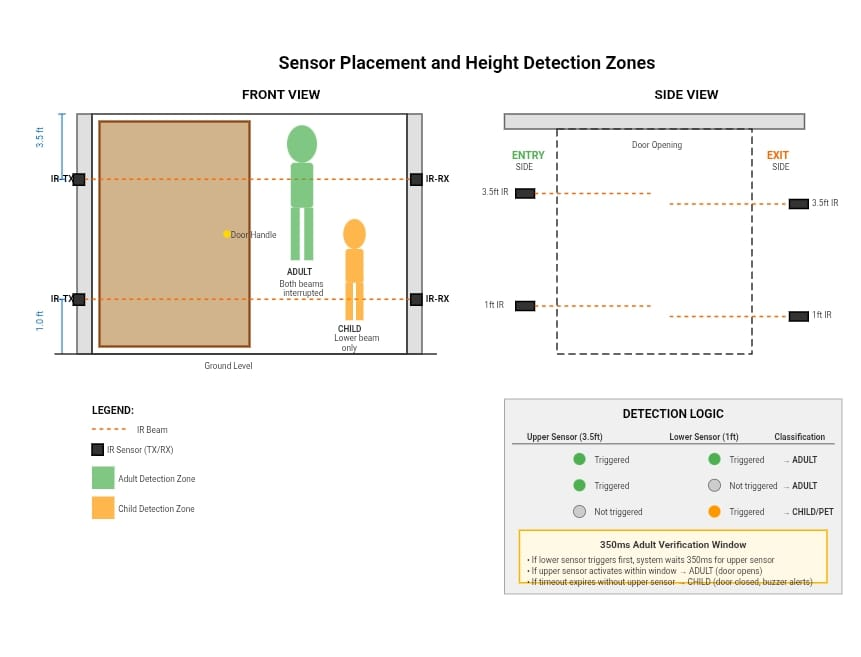
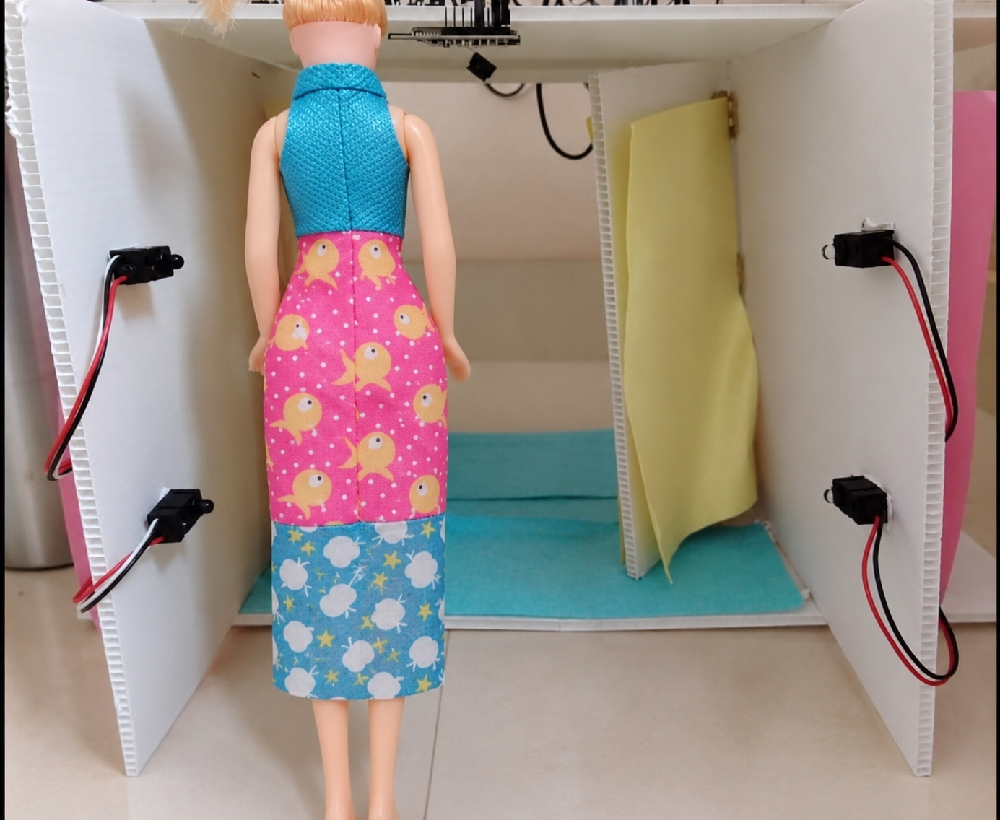
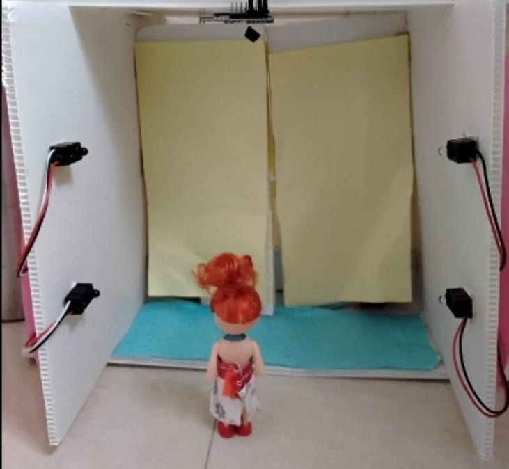
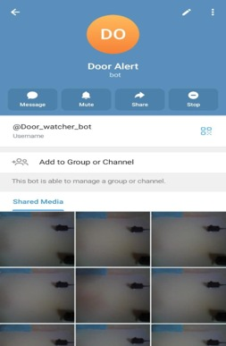
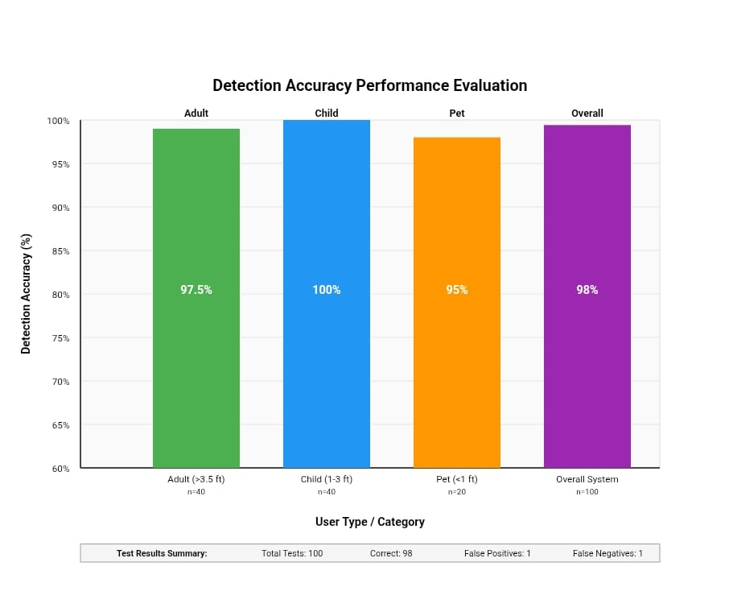
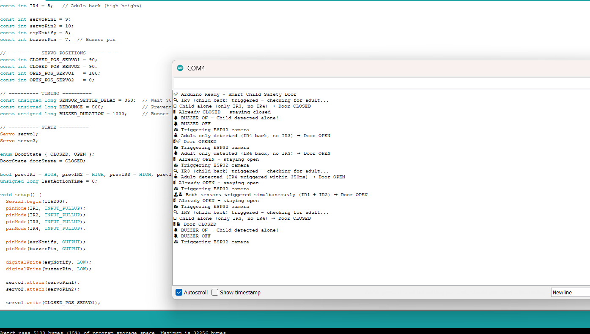

Smart Height-Based Child Safety Door System

An IoT-enabled smart door system designed to distinguish between adults and children using multi-level IR sensors, automated door control, local alerts, and event-triggered image notifications.

📌 Overview

The Smart Height-Based Child Safety Door System is a prototype designed to improve indoor child safety by automatically classifying a person based on height.

The system uses four IR break-beam sensors arranged at two different heights on the entry and exit sides of the door. An Arduino UNO processes the sensor inputs and determines whether the detected person is an adult or a child.

Two SG90 servo motors control the door, while a buzzer provides a local alert for child detection.

An ESP32-CAM captures an image when a detection event occurs and sends the image through Wi-Fi to a predefined Telegram account.

The prototype achieved approximately 98% overall classification accuracy across 100 tested scenarios.

🎯 Problem Statement

Conventional automatic doors generally detect the presence of a person but do not distinguish between adults and children.

This project addresses this limitation using height-based multi-level IR sensing to classify the detected person and provide an appropriate response.

💡 Key Features

- Height-based adult and child classification
- Four IR break-beam sensors
- Detection from entry and exit sides
- Automatic door control using two servo motors
- Buzzer alert for child detection
- Event-triggered ESP32-CAM image capture
- Telegram notification through Wi-Fi
- Adjustable sensor verification timing
- Privacy-oriented event-based image capture

🏗️ System Architecture

The main system consists of:

IR Sensors → Arduino UNO → Classification & Control → Servo Motors / Buzzer

For image notification:

Arduino UNO → ESP32-CAM → Wi-Fi → Telegram

System Architecture

🔧 Hardware Components

Component| Quantity| Purpose
Arduino UNO| 1| Sensor processing and system control
ESP32-CAM| 1| Image capture and IoT notification
IR Break-Beam Sensors| 4| Height-based detection
SG90 Servo Motors| 2| Door movement
Buzzer| 1| Child-detection alert
5V 3A Power Adapter| 1| Power supply
Prototype Door/Frame| 1| Demonstration setup

💻 Software & Technologies

- Arduino IDE
- Embedded C/C++
- Arduino UNO
- ESP32-CAM
- Servo library
- ESP32 camera library
- Wi-Fi communication
- Telegram Bot API

📐 

The prototype uses two sensing levels:

- Lower sensor level: approximately 6 cm
- Upper sensor level: approximately 16 cm

These prototype dimensions represent scaled versions of approximately 1 ft and 3.5 ft respectively for a full-scale implementation.

Four sensors are arranged as:

- Front lower sensor
- Front upper sensor
- Back lower sensor
- Back upper sensor

Sensor Arrangement

⚙️ Working Principle

The system determines the detected person's category based on which IR sensors are interrupted.

When the upper sensor is triggered, the system classifies the person as an adult.

The Arduino:

1. Classifies the person as an adult.
2. Opens the door using the servo motors.
3. Triggers the ESP32-CAM.
4. Captures an image.
5. Sends the image through Telegram.

When only the lower sensor is triggered, the system waits for approximately 350 ms for an upper-sensor response.

If the upper sensor is not triggered:

1. The person is classified as a child.
2. The door remains closed.
3. The buzzer is activated.
4. The ESP32-CAM is triggered.
5. An image is sent through Telegram.

🚪 Prototype

Two SG90 servo motors are used to provide balanced door movement.

📡 IoT & Telegram Notification

The ESP32-CAM operates as an event-triggered camera.

When a relevant detection event occurs, the Arduino triggers the ESP32-CAM. The camera captures a JPEG image and sends it through Wi-Fi to Telegram.

📊 Experimental Results

The prototype was evaluated using 100 test scenarios.

Category| Test Cases| Correctly Classified| Accuracy
Adult| 40| 39| 97.5%
Child| 40| 40| 100%
Pet| 20| 19| 95%
Overall| 100| 98| 98%

Detection Accuracy

Serial Monitor

Adult Detection

⚡ Performance

According to the experimental evaluation:

- Overall classification accuracy: 98%
- Adult classification accuracy: 97.5%
- Child classification accuracy: 100%
- Pet/object test accuracy: 95%
- Reported average system response: approximately 350 ms
- Camera transmission success: approximately 95%
- Average image transmission time: approximately 2.8–3 seconds

⚠️ Limitations

- Multiple-person simultaneous detection is not handled.
- Strong sunlight or halogen lighting may affect IR sensing.
- Height ambiguity may occur between a tall child and a short adult.
- The prototype uses small-scale sensor spacing and servo motors.
- Full-scale implementation would require longer-range sensors and stronger actuators.
- Wi-Fi connectivity affects remote image transmission.

🚀 Future Improvements

- Ultrasonic or thermal sensing as a secondary classification method
- TinyML-based classification using ESP32-S3
- Industrial-grade motors and actuators
- Improved lighting immunity
- Multi-person detection
- Web/mobile monitoring dashboard
- Voice-assistant integration

📄 Documentation

The complete technical details, methodology, experimental setup, results, and references are available in the project paper.

👩‍💻 Team

Aisha Rushan
Deeksha Manjunath Naik
Sahana Anand Naik
Navin Kasim

Department of Electronics and Communication Engineering
Anjuman Institute of Technology & Management (AITM), Bhatkal

📚 Reference

“Smart Height-Based Child Safety Door System Using IoT and Dual-Sensor Classification.”
